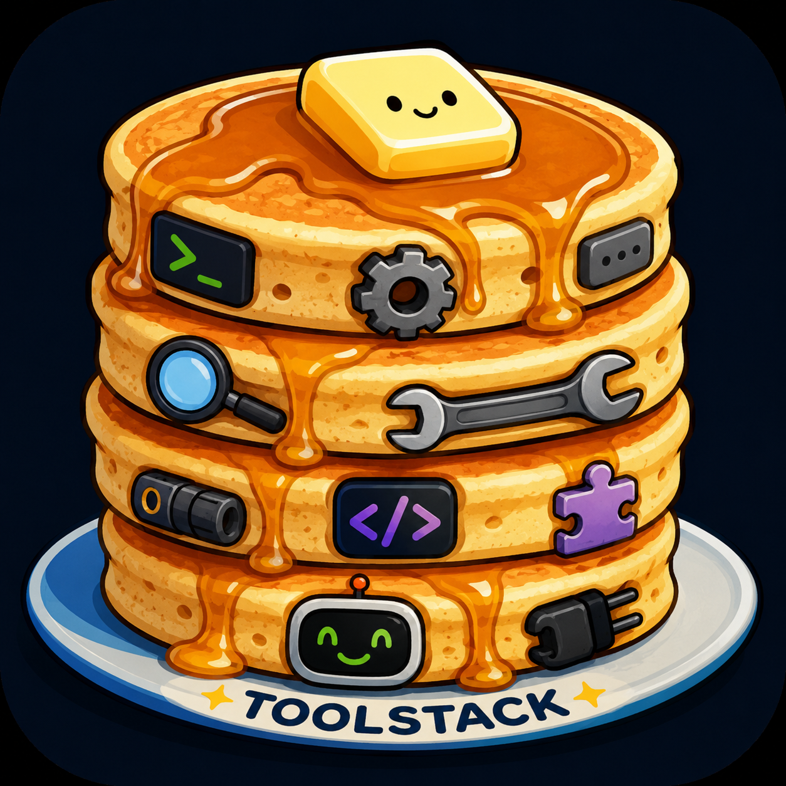
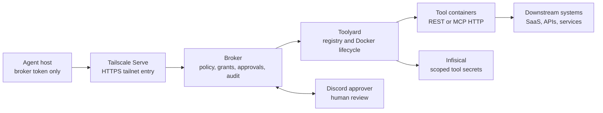

<p align="center">
  
</p>

# Toolstack

**Action without access for agent tools.**

Toolstack is a local-first risk-management architecture for giving agents useful
capabilities without handing them broad credentials. The agent gets a narrow
broker token and a way to request work. The broker owns policy, approval, audit,
and routing. Tool servers do the real work on infrastructure the agent cannot
rewrite.

The thesis is simple: do not ask "how do I safely give this agent my secrets?"
Ask "how do I let this agent request useful actions without giving it ambient
authority?"

## Why This Exists

Agents are not ordinary API clients. A capable agent can inspect wrappers,
search local config, infer hidden API shapes, write replacement code, and use
whatever credentials the host exposes. If the agent has a raw SaaS token, SSH
key, cloud profile, database password, or broad MCP server credential, the
wrapper around that credential is not the boundary. The credential scope is the
real authority.

Toolstack approaches this as surface reduction and centralization:

- **Reduce what the agent can reach.** The agent can reach the broker, not the
  tool containers, downstream APIs, or secret source.
- **Centralize authorization.** Policy, approvals, grants, revocation, and audit
  happen in one broker instead of being scattered across local scripts.
- **Separate intent from authority.** Agents ask for semantic operations;
  services with scoped credentials execute only what policy allows.
- **Make risky actions visible.** Human approval describes the operation and its
  target, not just a local command.
- **Keep secrets with workloads.** Tool credentials are resolved by Toolyard and
  injected into isolated containers. They are not handed to the agent host.

## System Shape



The broker is the authority boundary. Toolyard is the execution and secret
boundary. The agent host is deliberately kept out of the downstream credential
path.

## How Toolstack Reduces Risk

| Risk | Toolstack's control |
|---|---|
| Agent receives raw downstream credentials | Agent holds only a broker token |
| Agent bypasses a local wrapper | Tool servers are not directly reachable from the agent host |
| Every tool reinvents auth and audit | Broker centralizes policy, grants, approvals, and logs |
| Approval fatigue hides what is happening | Approval cards show caller, tool, operation, arguments, and risk |
| One tool compromise exposes every secret | Toolyard resolves per-tool secrets and injects only declared fields |
| New tools accidentally become available | Each caller policy must explicitly allow tools and operations |

## Components

- [`broker/`](broker/) is the authority boundary. It authenticates callers,
  evaluates caller-owned policy, dispatches approved actions, and records audit
  events.
- [`toolyard/`](toolyard/) is the Docker lifecycle runner and per-tool secret
  boundary. It reads `tools/<id>/toolyard.yaml`, starts enabled tools, and
  injects resolved secrets into container tmpfs.
- [`discord-approver/`](discord-approver/) is the human approval surface for
  requests that policy marks as review-required.
- [`tools/`](tools/) contains small example tool containers. Current examples
  are `hello-rest` and `time-mcp`.
- Infisical Universal Auth credentials live in host-side env files and are
  consumed by Toolyard at workload start.
- [`docs/`](docs/) contains the thesis, architecture, component specs,
  deployment guide, operator guide, and archived historical plans.

## Where To Start

- **Understand the philosophy:** read
  [`docs/trust-agents-with-action-not-access.md`](docs/trust-agents-with-action-not-access.md).
- **Understand the architecture:** read
  [`docs/design/01-architecture.md`](docs/design/01-architecture.md), then
  [`docs/design/00-principles.md`](docs/design/00-principles.md).
- **Find your way through the docs:** start at [`docs/README.md`](docs/README.md).
- **Run or operate it:** use [`docs/deployment/README.md`](docs/deployment/README.md)
  and [`docs/user-guide.md`](docs/user-guide.md).
- **Add a tool:** start with
  [`docs/design/21-tool-template.md`](docs/design/21-tool-template.md) and the
  examples under [`tools/`](tools/). For the matching agent-side wrapper, use
  [`docs/design/22-agent-skill-convention.md`](docs/design/22-agent-skill-convention.md).

## Local Development

Each Python service is currently developed as its own package:

```bash
cd broker
python3 -m venv .venv
source .venv/bin/activate
pip install -e ".[dev]"
python -m pytest tests/ -q
```

Repeat the same pattern in `toolyard/` and `discord-approver/`.

Some tool tests require dependencies from `tools/<tool>/requirements.txt`.
Docker-backed tests may also require a local Docker daemon.

## Configuration And Secrets

Real tokens, `.env` files, SQLite state, audit logs, virtualenvs, and generated
build artifacts are intentionally ignored. Use the example files under
`docs/deployment/env/` as templates.

Deployment examples use placeholder hostnames such as
`https://broker.your-tailnet.ts.net` and placeholder token file paths. Replace
them with values for your own environment outside the repository.
