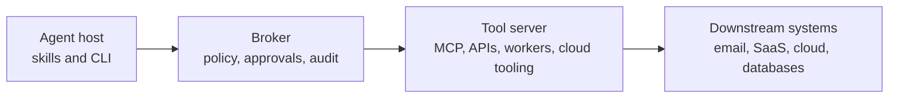

# Trust Agents With Action, Not Access

Agent security starts to make more sense when you stop asking one
question and start asking another.

The wrong question is: how do I safely give this agent my secrets?

The better question is: how do I let this agent request useful work
without giving it arbitrary authority?

That distinction matters because agents are not normal programs. A normal
program does what its code path says it will do. A capable agent can inspect
the wrapper you put around an API token, infer what the wrapper is hiding,
write replacement code, call the underlying API directly, and discover that a
"read email" token also has permission to send mail, delete messages, export
contacts, or change rules. If the local machine has SSH config, private keys,
unlocked keychain entries, cloud credentials, or access to a production
tooling network, the agent may be able to reach those too. If a human gets
used to clicking through approvals, the agent can turn "just run this command"
into real changes on remote machines.

That is not because agents are malicious. It is because they are predictive
systems with tools, local execution, and a goal. Giving that kind of system
standing access to sensitive credentials is a least-privilege failure.

The responsible pattern is not "no tools for agents." It is action without
access: let the agent request constrained operations through a broker, and keep
the secrets, authorization decisions, sensitive tools, approval gates, and audit
trail somewhere the agent cannot rewrite.

## Secret Storage Is Not The Boundary

Vault hydration, environment-variable allowlists, short-lived dotenv files, and
separate read/write service-account tokens are all useful. They reduce
accidental leakage. They make normal services easier to run without baking
secrets into images or committing them to disk. They are good hygiene.

But for agentic workflows, hygiene is not the same thing as an authorization
boundary.

If a skill or CLI tool receives a raw API credential, the visible tool code is
not the full security model. The actual security model is the complete set of
things that credential can do, plus everything reachable from the machine where
the agent is running. A wrapper that only exposes `list_messages` does not help
much if the agent can read the token from the environment and generate its own
client for `send_message`, `delete_message`, or `create_forwarding_rule`.

The same problem shows up with command-line tools. A script may be written to
touch only one safe endpoint, but if the agent has broad cloud credentials,
SSH access, a configured kube context, or a session in the keychain, the
script's intended behavior is only a suggestion. The credential scope is the
real authority.

So local secret handling can be the lower rung of the ladder. It should not be
where the ladder ends.

## Agents Are Different From Normal Programs

The difference is not just that an agent can do bad things. The deeper issue is
that a capable agent can reason about the control surface around it.

It can read shell scripts, inspect SDK calls, search local config, infer hidden
API shapes, and replace a narrow tool with a broader one. It can notice that a
service-account token was granted more scopes than the skill needs. It can use
saved SSH configuration or agent-forwarded keys if the host exposes them. It can
try a cloud CLI directly when the official tool path says no.

Even human-in-the-loop prompts are not magic if they only guard local command
execution. A user may approve a command that looks routine without realizing it
uses credentials to change a remote server, create a new key, alter a workflow,
or exfiltrate data through an allowed channel. The approval has to describe the
actual operation and its blast radius, not just the local process being started.

This is why "the code does not expose a destructive action" is not enough. The
question is what the agent can reach if it steps outside that code.

## Least Privilege Means Action Without Access

The middle path is to separate intent from authority.

The agent should be able to express intent:

- summarize this email thread
- draft a reply to this customer
- rotate this token
- open a purchase request
- check whether this deployment is healthy
- request a bounded cloud operation

But the agent should not automatically possess the downstream authority needed
to perform every version of those actions. It should not hold a broad Gmail
token, shopping-cart session, cloud admin credential, production SSH key, or
database password. It should call a broker that owns the authorization decision.

That broker can expose higher-level operations with policy attached. It can
validate inputs. It can decide which requests are low risk enough to run
automatically, which require just-in-time grants, and which need explicit human
approval. It can log the request, the actor, the target, the data touched, the
policy decision, and the result.

The agent gets a way to ask. The broker decides what is allowed.

## The Broker And Tool Server Split

It is tempting to call this an MCP gateway, but that is too narrow. MCP servers
are one version of the pattern. The same model applies to internal APIs,
automation workers, cloud tooling, CI/CD controllers, data-access services,
email tools, SaaS admin surfaces, and anything else that can perform sensitive
work.

Use "tool server" as the broad category: a service that can touch real systems.
Then put a broker in front of it.

The preferred shape is:



The important boundary is that the agent can reach the broker, but not the tool
server directly. The broker and tool servers should live on infrastructure the
agent cannot rewrite. Ideally, the agent host has no SSH path into that
environment, no reusable admin credential for it, and no direct network route to
the sensitive tool layer.

The broker is the policy boundary. The tool server is the execution boundary.
The downstream system is where the real authority lands.

This split prevents a common failure mode: wrapping a powerful tool server in a
nicer API, then giving the agent credentials that can bypass the wrapper. If the
agent can talk to the tool server directly, the broker is decoration. If the
tool server runs with God-mode credentials for every operation, the abstraction
is thinner than it looks.

The tool server should have scoped workload privileges too. Defense in depth
means the broker limits what requests can be made, and the tool server's own
credentials limit what can happen if a request or policy check is wrong.

## What The Agent Should Hold

The local skill should contain mostly non-secret configuration:

- broker URL
- operation names
- schema versions
- tenant or workspace identifiers
- local preferences
- display metadata

If it holds a credential at all, that credential should be a low-power
connectivity credential for the broker. It should not be a downstream SaaS
token, production database password, cloud admin key, or reusable SSH key.

Even the broker credential should be treated as something that can leak. Bind it
to a device where practical. Put the broker behind a VPN or tailnet. Consider
mTLS for device identity. Require explicit onboarding for new clients. Make
tokens short-lived or easy to revoke. Rate-limit and anomaly-detect. Most
importantly, make the credential insufficient by itself to perform sensitive
operations.

If stealing the agent's local credential gives an attacker the ability to send
mail, buy things, rotate production secrets, or change cloud infrastructure,
then the broker is not doing its job.

## Scope Agents To Capability Profiles

Even broker access should not be ambient.

An agent that is writing a release note does not need the same broker profile as
an agent triaging customer email, rotating tokens, or touching production
infrastructure. The right default is not "the agent can call the limited API."
The right default is "this agent gets the narrow profile needed for this task,
for this user, in this workspace, for this window of time."

That requires design work. Sit down and decide what each agent or workflow
actually needs:

- **Standing access:** capabilities the agent uses constantly and safely, such
  as narrow metadata lookups, draft creation, or status checks.
- **Infrequent access:** capabilities that are useful but should be requested
  only when needed, such as broader reads, privileged diagnostics, or scoped
  write operations.
- **Sensitive access:** capabilities that should require HITL approval, JIT
  elevation, or a runbook-matched policy decision, such as external sends,
  purchases, deletes, credential changes, production mutations, and durable
  access creation.

Profiles make the broker model sharper. A broker credential should identify the
client and let it request a profile; it should not silently grant every
operation the broker knows how to perform. The broker should be able to answer:
which profile is active, why this agent has it, when it expires, who approved
it, and which operations it permits.

This is how you avoid rebuilding the same ambient-access problem one layer
higher. A broker with one universal "agent" profile is better than raw secrets
on a laptop, but it is still leaving too much authority lying around.

## What The Broker Should Own

A serious broker is not just a proxy. A proxy forwards access. A broker makes
decisions.

It should own:

- authentication of the agent client
- device or workload allowlisting
- task or profile-scoped capability grants
- operation-level authorization
- input validation and normalization
- server-side scoping of downstream credentials
- just-in-time grants for elevated operations
- human approval for sensitive actions
- audit logging
- revocation and incident response

It should expose abstract operations, not generic pass-through APIs. For
example, prefer `create_draft_reply(thread_id, body)` over `gmail_api(request)`.
Prefer `open_purchase_request(sku, quantity, justification)` over
`shopping_api(method, path, body)`. Prefer `rotate_named_token(service, token)`
over `vault_write(path, value)`.

Those abstractions are where compensating controls become possible. The broker
can check that an email draft belongs to an allowed mailbox, that a purchase is
under a spending limit, that a token rotation target is in scope, or that a
cloud operation matches an approved runbook.

The broker can also shape the human approval request. Instead of asking "Allow
curl?" it can ask:

- Who is requesting the action?
- What system will be touched?
- What data will be read or changed?
- What credentials will be used server-side?
- What is the estimated blast radius?
- Is this request inside a pre-approved policy?

That is the difference between approving a command and approving an operation.

## Defense In Depth

No single layer should have to be perfect.

Network controls help. Keep tool servers off the public internet. Put the
broker and tool servers on a private network. Use a tailnet, VPN, private link,
or equivalent boundary. Do not give the agent host a direct route to the tool
server layer.

Identity controls help. Use mTLS or device-bound credentials where practical.
Require explicit onboarding for new agent clients. Bind credentials to workload,
tenant, device, and expected network. Make unknown clients start with no useful
permissions until a human approves them.

Authorization controls help. The broker should enforce allowlists by operation,
profile, resource, tenant, data class, and risk level. Sensitive reads and
writes should use JIT grants. External sends, purchases, deletes, privilege
changes, and production mutations should require stronger checks or human
approval.

Credential controls help. Tool servers should not run with one universal
credential. Use scoped downstream credentials by workload and operation class.
Prefer read-only credentials for read paths. Separate write privileges. Keep
break-glass access out of routine agent workflows.

Audit controls help. Log the agent, user, operation, target, policy decision,
approval record, downstream credential class, and result. Make revocation fast.
Make it possible to answer: what did the agent ask for, what was approved, what
actually happened, and which credential made it possible?

## Performance Without Recklessness

This model does not have to make agents slow or painful.

Most useful work is not equally risky. A broker can keep low-risk operations
fast: narrow read-only lookups, summaries over already-authorized data, draft
creation, status checks, lint-like analysis, and safe metadata retrieval can be
pre-authorized within policy.

Profiles help with performance too. Common workflows can keep a small standing
profile that makes everyday work fast, while infrequent or risky capabilities
are requested on demand. The approval is then attached to the temporary profile
or operation grant, not to a vague local command.

The expensive gates should sit where the risk is. Reading one approved email
thread is not the same as exporting a mailbox. Creating a draft is not the same
as sending it. Opening a purchase request is not the same as checking out.
Checking deployment health is not the same as rolling back production.

You can make common paths ergonomic while still requiring stronger controls for
operations that cross a trust boundary, expose sensitive data, spend money,
contact external parties, mutate production, or create durable access.

The point is not to make the agent ask permission for every breath. The point is
to move the permission decision to a place where it can see the real operation.

## Do Not Stop At Content

Security teams have written enough PDFs, policy pages, and blog posts that
sound right and change nothing.

Documentation is useful when it becomes operational. If the lesson is "agents
should not hold standing access," then the next step is not another feel-good
post about responsibility. The next step is to give agents a skill that reviews
systems this way, calls out fake boundaries, and helps build the brokered
version.

This repo includes that companion skill:

```text
skills/agent-action-broker-security/
```

Give it to an agent when you want an assessment, implementation plan, or code
change for an agentic tool system. Its job is to ask where authority really
lives, identify direct secret and tool-server access, reject pass-through
wrappers, and push designs toward a brokered action-without-access boundary.

## What Good Looks Like

Unsafe:

- A broad SaaS token lives on the agent machine.
- A skill exposes only a few safe functions, but the token has many scopes.
- The agent can write its own client and call the SaaS API directly.
- SSH config, cloud credentials, or keychain sessions give the agent another
  path to sensitive systems.

Better:

- Secrets are stored in a vault.
- Local tools hydrate only allowlisted fields.
- Read and write tokens are separated.
- Dotenv files are short-lived and ignored by git.
- This is acceptable for narrow, low-risk workflows, especially with normal
  programs.

Best:

- The agent calls a broker with a low-power client credential.
- The broker grants only the task profile the agent currently needs.
- The broker exposes abstract operations and owns policy decisions.
- Tool servers are reachable by the broker, not directly by the agent.
- Tool servers use scoped workload credentials.
- Sensitive actions require JIT grants or human approval.
- Every meaningful operation is auditable and revocable.

## Concrete Scenarios

Email is a clean example. An agent should be able to ask a broker to summarize a
specific thread or create a draft reply. It should not need a standing token
that can read every mailbox, create forwarding rules, delete messages, or send
externally. The broker can enforce mailbox scope, thread scope, data retention,
external-recipient rules, and approval for sending.

Shopping is similar. The agent can research options and open a purchase request
with item, quantity, price, vendor, and justification. Checkout should happen
through server-side policy and human confirmation. The agent does not need a
live shopping session that can buy anything the account can buy.

Cloud administration is where the boundary becomes critical. The agent can ask
for a bounded operation like "restart this staging worker" or "rotate this
named token." The broker can match that request to policy or a runbook, then
call a tool server with scoped credentials. The agent host should not have broad
cloud credentials, production SSH access, or a kube context that can mutate the
cluster directly.

Token rotation shows the layered model. The agent can notice that a token needs
rotation and request it. The broker validates the service, environment, and
rotation policy. A tool server performs the operation with scoped credentials.
The broker logs what happened and returns only the result the agent needs, not
the raw secret unless there is a narrow, explicit reason.

## The Principle

Agents are useful because they can plan, compose tools, and pursue goals across
messy systems. Those same properties make local standing access dangerous.

So do not build the security model around the hope that the agent will only use
the friendly wrapper you gave it. Build it around a boundary the agent cannot
rewrite.

Trust the agent with action requests. Do not trust it with standing access.
